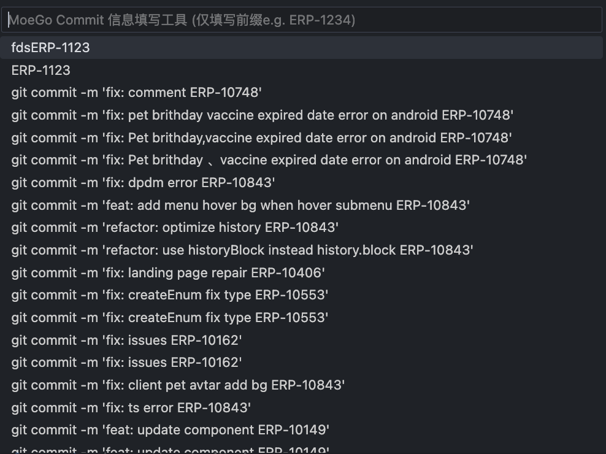

<h1 align="center">moego-commit-helper</h1>

## Usage

打开终端，随后通过 `cmd+shift+p` 打开命令面板，输入 `moego-commit-helper`，选择所需的功能

出现对应的选择框，选择所需要填入的内容，最后按下 `Enter` 键即可。

### 快捷键

- `cmd+shift+T` 打开 `moego-commit-helper-only-prefix` 面板
- `cmd+shift+A` 打开 `moego-terminal-helper` 面板

可以在 `vsc` 自定义快捷键，搜索 `moego-commit-helper` 即可找到对应的命令。
